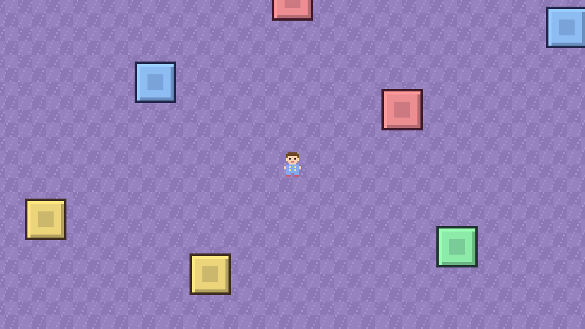

# Zombie-dreams
test game on unity vibe coding

The design doc is in [docs/design.md](docs/design.md).

## Opening the game

1. Open **Unity Hub**, click **Add** > **Add project from disk**, and pick the `ZombieDreams` folder inside this repo.
2. Open it with **Unity 6000.6.3f1**. The first open takes a few minutes while Unity rebuilds its `Library` folder.
3. In the **Project** window, open `Assets/Scenes/Bedroom`.
4. Press **Play**. Move Isaac Jr. with WASD, the arrow keys, or a gamepad's left stick.

## What's in the project (steps 1-3)

| File | What it does |
|---|---|
| `Assets/Scripts/PlayerMovement.cs` | Reads WASD / arrows / left stick with the new Input System and moves Isaac Jr.'s Rigidbody2D. Change `Move Speed` in the Inspector. |
| `Assets/Scripts/CameraFollow.cs` | On the Main Camera. Smoothly glides after the player. Lower `Smooth Time` for a snappier camera. |
| `Assets/Scenes/Bedroom.unity` | The arena: a 100x100 tiled carpet floor, 8 toy blocks you bump into, Isaac Jr., and the camera. |
| `Assets/Scripts/Zombie.cs` | The Sleepwalker: walks in a straight line at Isaac Jr. (speed 1.8, he walks at 5) and hurts him on touch. Has 20 HP (two pillows); when defeated it leaves a poof and an XP gem. |
| `Assets/Scripts/PillowToss.cs` | Isaac Jr.'s starting weapon. Throws a pillow at the nearest zombie every 0.8 s, all by itself. Strength comes from `PlayerStats`. |
| `Assets/Scripts/Projectile.cs` | The reusable flying attack (pillows now; Scarlet and other weapons later): flies straight, spins, hurts zombies it touches. |
| `Assets/Scripts/PlayerStats.cs` | All the upgradable numbers in one place (damage, projectile count, projectile speed, attack speed, attack size, pickup radius). Step 4's level-up cards change these. |
| `Assets/Scripts/XPGem.cs` | The "dream shard" a defeated zombie drops. Flies to Isaac Jr. when he gets close and gives him XP. |
| `Assets/Scripts/PlayerXP.cs` | Collects XP, tracks the level, shows a simple XP bar. Step 4 adds the level-up screen. |
| `Assets/Scripts/OneShotAnimation.cs` | Plays the purple "poof" puff once and removes it. |
| `Assets/Scripts/Spawner.cs` | Spawns zombies on a ring just off-screen. Starts at 0.5 per second and speeds up by 0.4 per second every minute (max 150 alive). All numbers are in the Inspector. |
| `Assets/Scripts/PlayerHealth.cs` | 100 HP, a short invulnerable blink after each hit, a simple HP bar, and "Bad dream..." then a restart at 0 HP. (The real HUD and game-over screens come in step 7.) |
| `Assets/Scripts/YSort.cs` | Draws things lower on screen in front of things higher up, so you can walk behind toy blocks and zombies. |
| `Assets/Prefabs/` | `Sleepwalker` (the zombie, the Spawner copies it), `Pillow` (the thrown pillow), `XPGem` and `Poof`. |
| `Assets/Scripts/PlayerAnimator.cs` | Picks which picture of Isaac Jr. to show: 8 facing directions, 2 idle frames, 4 walk frames. |
| `Assets/Art/IsaacJr/IsaacJr.png` | Isaac Jr. (pajamas, no sword) with Scarlet the cat on his shoulder: 8 directions x 6 frames, 48x48 each. Generated, see below. |
| `Assets/Art/` | Placeholder toy block and carpet tile. |
| `art-source/items/` | The pillow, XP gem and poof sprites. `python build.py` there rebuilds their sheets in `Assets/Art/`. |
| `art-source/sleepwalker/` | The Sleepwalker zombie, same text-grid method. `python build.py` there rebuilds `Assets/Art/Sleepwalker/Sleepwalker.png`. |
| `art-source/isaac-jr/` | The source for Isaac Jr. and Scarlet: text-grid sprites in `grids/` (one letter = one pixel, colors in `palette.py`), `layout.json` (which view and where Scarlet sits per direction). |



## Rebuilding Isaac Jr.'s sprite sheet

Needs Python with Pillow (`pip install pillow`). From `art-source/isaac-jr`:

```
python build.py          # full build once every frame is painted
python build_rough.py    # fills any missing frame with a stand-in, so it always works
```

Both write `ZombieDreams/Assets/Art/IsaacJr/IsaacJr.png`. Unity re-imports it automatically.
